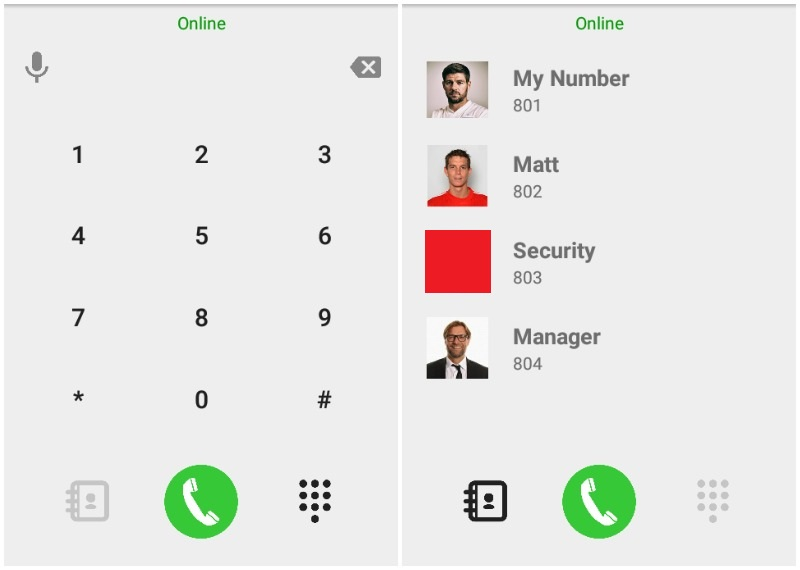

# Numpad and Contact Screen for Android App (xml)

## About 
Layout file for call and contact screen for Android native app, can be used right away.  
For any enquiries, please contact me:  
 

## Usage
- Using `call_screen.xml`
- Icons included

## Credits
- Icons created by [fa2png.io](http://fa2png.io/)
- Screen shots used sample images of [Steven Gerrard](https://en.wikipedia.org/wiki/Steven_Gerrard), [Daniel Agger](https://en.wikipedia.org/wiki/Daniel_Agger) and [Jurgen Klopp](https://en.wikipedia.org/wiki/J%C3%BCrgen_Klopp)